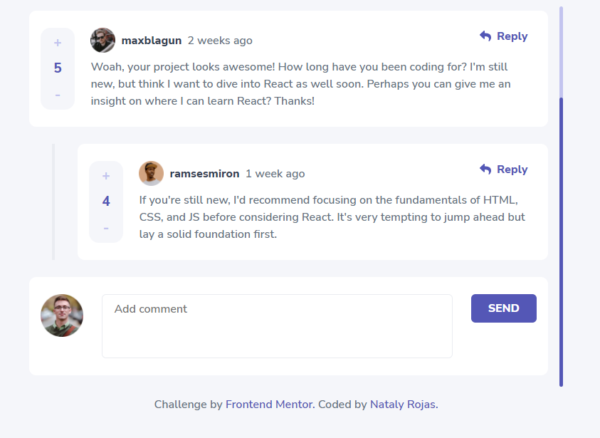

# Interactive Comments

## This project is based on one of the [Frontend Mentor](https://www.frontendmentor.io/) challenges.

### [Interactive comments section challenge hub](https://www.frontendmentor.io/challenges/interactive-comments-section-iG1RugEG9)

# The challenge

- Challenge is to build out this interactive comments section and get it looking as close to the design as possible.

- Users should be able to:- Users should be able to:

  - View the optimal layout for the app depending on their device's screen size
  - See hover states for all interactive elements on the page
  - Create, Read, Update, and Delete comments and replies
  - Upvote and downvote comments
  - Bonus: If you're building a purely front-end project, use localStorage to save the current state in the browser that persists when the browser is refreshed.

# Technologies used

- React + Typescript
- Context + Redux
- Scss
